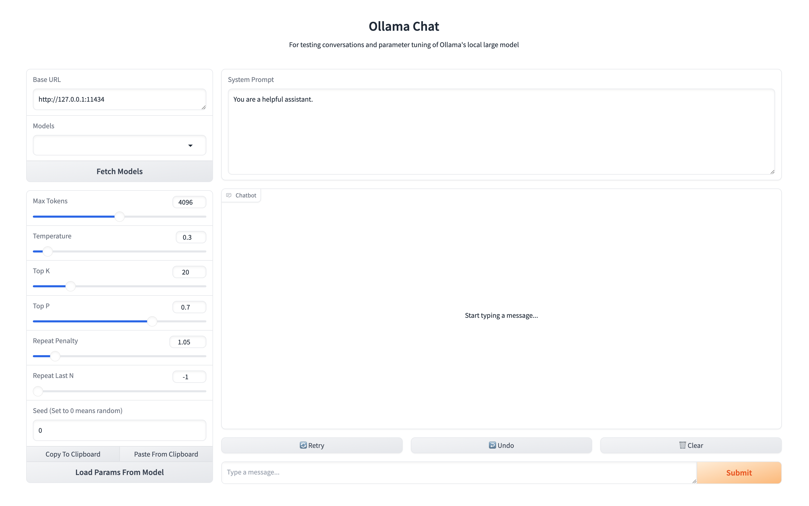

<h1 align="center">Ollama Chat</h1>

<div align="center">
  For testing conversations and parameter tuning of Ollama's local large model
</div>

<br />

<div align="center">
  <!-- GitHub license -->
  <a href="https://github.com/CairoLee/ollama-chat/blob/master/LICENSE">
    
  </a>
</div>

<div align="center">
  <h3>
    <a href="https://ollama.com/" target="_blank">
      Ollama
    </a>
    <span> | </span>
    <a href="https://www.gradio.app/" target="_blank">
      Gradio
    </a>
  </h3>
</div>

<div align="center">
  <sub>
  If this project is helpful to you, please give it a ★Star.
  <br />
  Craft with ❤︎ by
  <a href="https://github.com/CairoLee">CairoLee</a> and
  <a href="https://github.com/CairoLee/ollama-chat/graphs/contributors">
    Contributors
  </a>
  </sub>
</div>

## Screenshots



## Features

- Fetch the model list from Ollama's server
- Support load parameters from model
- Re-sending the same dialogue for testing after changing parameters and prompts is more concise.

## Quick Start

### Requirements

- [Python 3.9+](https://www.python.org/downloads/)
- [Poetry](https://python-poetry.org/docs/#installing-with-the-official-installer)

### Install poetry

We use poetry to manage dependencies.
If you don't have poetry installed, you can install it by running the following command in Linux, macOS, Windows (WSL):

```bash
curl -sSL https://install.python-poetry.org | python3 -
```

If you are using Windows, you can install it by running the following command in PowerShell:

```powershell
(Invoke-WebRequest -Uri https://install.python-poetry.org -UseBasicParsing).Content | py -
```

If you want to install poetry in other ways, you can refer to the [official documentation](https://python-poetry.org/docs/#installation).

### Install dependencies

Clone the repository and run the following command in the project root directory:

```bash
poetry install
```

### Run the app

Run the following command in the project root directory:

```bash
poetry run python main.py
```

Then you can visit `http://127.0.0.1:7860` in your browser to chat with Ollama.
